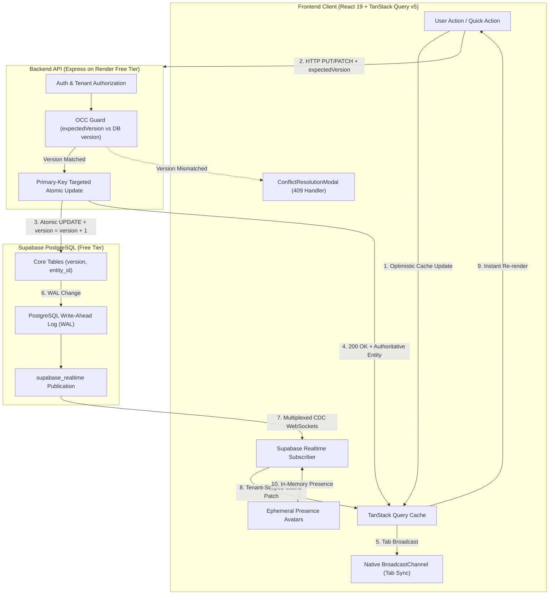
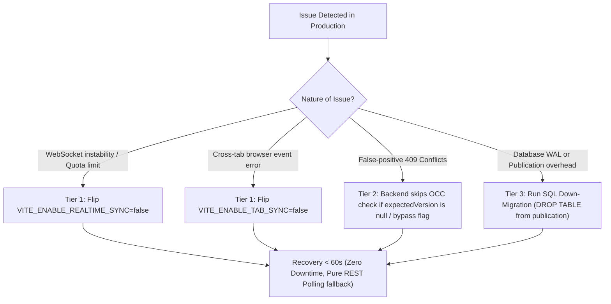
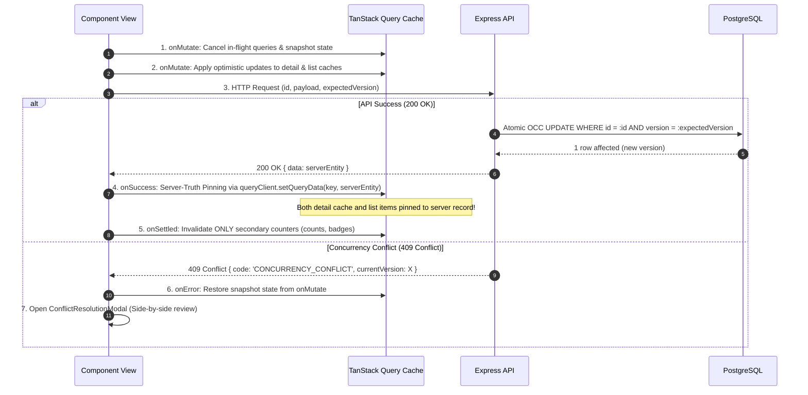
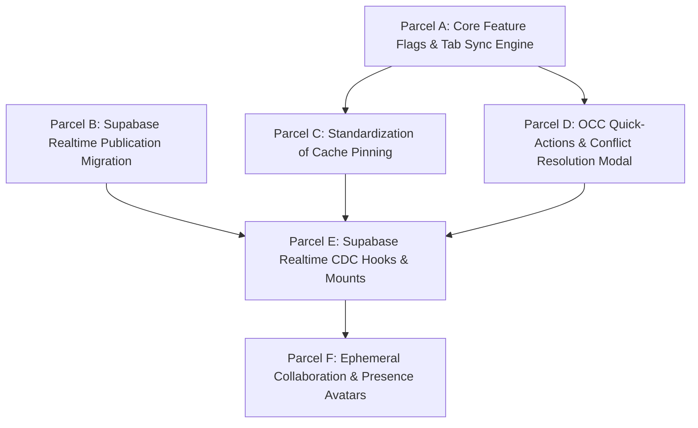

# System-Wide Concurrency, Persistence, and Real-Time Synchronization Specification
## ATA & LTA Accounting Firm ERP v2

---

## 1. Executive Summary & Architectural Overview

This document specifies the end-to-end technical implementation for system-wide state persistence, optimistic concurrency control (OCC), cross-tab synchronization, and Supabase Realtime CDC (Change Data Capture) across the ATA/LTA ERP platform.

### Core Objectives
1. **Durable Single-User Persistence**: Every user action (status transitions, checklist toggles, line item adjustments, disbursement approvals) persists immediately to PostgreSQL, updates all active views with zero UI flicker, and survives hard browser refreshes.
2. **Deterministic Multi-User Consistency**: When multiple employees (Admins, Managers, Operations staff, Accounting, Documentation) interact concurrently with the same records, changes propagate in real time without continuous polling, and conflicting edits are intercepted gracefully via RFC 7807 `409 Conflict` resolution rather than silent data overwrites.
3. **100% Free-Tier Budget Compliance**: Operates within the free tiers of Render (Web Services) and Supabase (PostgreSQL + Realtime WebSockets) for 15+ concurrent users without extra infrastructure or recurring costs.
4. **Instant Zero-Downtime Rollback**: Every module is protected by client-side feature flags, backward-compatible API contracts, and bidirectional SQL migrations, enabling instant (< 2 minute) rollback without database downtime or breaking live traffic.
5. **Teamwork-Preview Autonomy**: Scoped into discrete, bounded work parcels tailored for `antigravity gemini 3.8 medium on teamwork-preview` to execute without ambiguity, merge collisions, or context exhaustion.



---

## 2. Hard Rollback Doctrine & Zero-Downtime Guarantee

To eliminate deployment risks, the entire concurrency architecture is governed by a **Three-Tier Safety Net**. Any component can be deactivated independently without taking down the application or corrupting user data.



### 2.1 The Three-Tier Safety Net

#### Tier 1: Client Runtime Feature Flags (Instant Fallback, 0 Redeployments if using localStorage overrides)
In [`frontend/src/lib/flags.ts`](file:///home/javvii/FreelanceProject/ata-lta-erp-v2/frontend/src/lib/flags.ts), concurrency features are controlled by typed toggles with safe fallbacks:
- `realtime_sync`: Defaults to `import.meta.env.VITE_ENABLE_REALTIME_SYNC !== 'false'`. If `false`, WebSocket listeners are completely unmounted; TanStack Query continues using window focus refetches and background staleness checks.
- `tab_sync`: Defaults to `import.meta.env.VITE_ENABLE_TAB_SYNC !== 'false'`. If `false`, `BroadcastChannel` messages are skipped; tabs function independently.
- `strict_occ`: Defaults to `import.meta.env.VITE_ENABLE_STRICT_OCC !== 'false'`. If `false`, quick actions omit `expectedVersion`, bypassing 409 conflict halts.

#### Tier 2: Backward-Compatible Schemas & API Contracts
- The backend Zod validation schemas (`billing`, `disbursements`, `clients`, `operations`, `transmittals`) treat `expectedVersion` as strictly **optional** (`z.number().int().positive().optional()`).
- If an older frontend build or a rolled-back frontend client sends a payload without `expectedVersion`, the backend **never rejects the request with 400 or 409**. It safely applies the update and increments `version = version + 1`.
- If the frontend needs to be rolled back to `v2.0.0-legacy`, the backend does not require code adjustments.

#### Tier 3: Bidirectional Database Migrations (Zero Data Loss)
- Core `version` columns already exist across all 11 mutable tables (seeded by `000031_concurrency_schema_hardening.js`).
- The new migration `000060_enable_supabase_realtime_publication.js` only touches PostgreSQL publication metadata (`ALTER PUBLICATION supabase_realtime ADD TABLE ...`).
- Rolling back the publication requires executing the `down` migration, which drops tables from the publication without modifying schema structures, column data, or row values.

---

### 2.2 Instant Rollback Runbook (Procedure in < 2 Minutes)

If any unexpected behavior occurs in staging or production:

#### Step 1: Emergency Realtime Killswitch (Turn off WebSockets)
To immediately revert to pure REST polling without redeploying code:
1. In the frontend hosting environment (Render or Cloudflare/Vercel), update the environment variable:
   ```bash
   VITE_ENABLE_REALTIME_SYNC=false
   VITE_ENABLE_TAB_SYNC=false
   ```
2. Trigger an instant redeploy or, for an active client session, execute in the browser console:
   ```javascript
   localStorage.setItem('erp_feature_override_realtime_sync', 'false');
   localStorage.setItem('erp_feature_override_tab_sync', 'false');
   window.location.reload();
   ```

#### Step 2: Emergency Database Publication Rollback
To detach tables from Supabase Realtime CDC in PostgreSQL:
```bash
cd /home/javvii/FreelanceProject/Project4_Final-Render/backend
npm run migrate:remote:staging -- down
# Or direct SQL execution via psql / Supabase SQL Editor:
ALTER PUBLICATION supabase_realtime DROP TABLE IF EXISTS work_requests;
ALTER PUBLICATION supabase_realtime DROP TABLE IF EXISTS tasks;
ALTER PUBLICATION supabase_realtime DROP TABLE IF EXISTS disbursements;
ALTER PUBLICATION supabase_realtime DROP TABLE IF EXISTS invoices;
```

#### Step 3: Verification of Rollback
1. Open browser developer console -> `Network` tab -> filter by `WS`. Confirm 0 active WebSocket connections to Supabase.
2. Edit a Work Request status -> confirm HTTP 200 OK via standard REST endpoint.
3. Refresh page -> confirm updated status remains persisted.

---

## 3. Free-Tier Budget Math & Infrastructure Quota

The ATA/LTA ERP operates on Render (Express API) and Supabase (PostgreSQL + Auth + Realtime).

| Service | Free Tier Quota Limit | Projected ERP Usage (15 Users &times; 3 Tabs = 45 Connections) | Margin / Safety Buffer |
| :--- | :--- | :--- | :--- |
| **Supabase Realtime WebSockets** | 200 concurrent connections | **~45 peak connections** | **77.5% headroom available** |
| **Supabase Realtime Messages** | 2,000,000 messages / month | **~180,000 messages / month** (~6,000/day across 22 work days) | **91.0% headroom available** |
| **Render Web Service CPU/RAM** | 0.1 CPU, 512 MB RAM | Express API processes only REST mutations; zero WebSocket socket servers on Render | **No extra server overhead** |
| **Cross-Tab Synchronization** | N/A (Client Browser API) | Unlimited (`BroadcastChannel` runs entirely in browser IPC memory) | **$0.00 / 0 KB network data** |

### Critical Free-Tier Architectural Rules
1. **Single Multiplexed WebSocket**: Never create multiple `createClient()` instances. A single client per browser instance multiplexes all table channels over a single WebSocket.
2. **Channel Teardown on Route Unmount**: Realtime channels must be subscribed only when the user is on the relevant module (Operations, Billing, Disbursements) and unsubscribed (`supabase.removeChannel(channel)`) when navigating away.
3. **Payload Throttling**: Never transmit heavy document binaries or base64 data over Realtime; Realtime payloads contain only row change records (`id`, `status`, `version`, `updated_at`).

---

## 4. Architectural Contracts & Standardized Patterns

### 4.1 The Optimistic Mutation & Cache Pinning Contract

To eliminate the "flash-revert" bug (where optimistic UI changes flip back to older states seconds later), every mutation hook across all modules must adhere to the 4-phase contract:



#### Standard TypeScript Pattern:
```typescript
const mutation = useMutation<Entity, ApiError, MutationVars, { snapshots: QuerySnapshot }>({
  mutationFn: async ({ id, data, expectedVersion }) => {
    return (await apiRequest<{ data: Entity }>(`/endpoint/${id}`, {
      method: 'PUT',
      body: JSON.stringify({ ...data, expectedVersion }),
    })).data;
  },
  onMutate: async ({ id, data }) => {
    // 1. Cancel running queries to avoid overwriting optimistic data
    await queryClient.cancelQueries({ queryKey: domainKeys.root() });
    
    // 2. Snapshot current caches
    const snapshots = queryClient.getQueriesData({ queryKey: domainKeys.root() });
    
    // 3. Optimistically patch detail and list caches
    queryClient.setQueryData(domainKeys.detail(id), (old: Entity | undefined) => 
      old ? { ...old, ...data } : old
    );
    // ... patch matching records in list queries ...
    
    return { snapshots };
  },
  onSuccess: (serverEntity, { id }) => {
    if (!serverEntity) return;
    // 4. SERVER-TRUTH PINNING: Directly write server payload into cache
    queryClient.setQueryData(domainKeys.detail(id), serverEntity);
    
    // Patch matching records across all cached lists with serverEntity
    const allLists = queryClient.getQueriesData<ListResponse>({ queryKey: domainKeys.lists() });
    for (const [key, list] of allLists) {
      if (list?.data && Array.isArray(list.data)) {
        if (list.data.some((item) => item.id === id)) {
          queryClient.setQueryData(key, {
            ...list,
            data: list.data.map((item) => item.id === id ? { ...item, ...serverEntity } : item),
          });
        }
      }
    }
  },
  onError: (_err, _vars, context) => {
    // 5. Restore cache from snapshot
    if (context?.snapshots) {
      for (const [key, value] of context.snapshots) {
        queryClient.setQueryData(key, value);
      }
    }
  },
  onSettled: (_data, _err, { id }) => {
    // 6. Invalidate ONLY secondary queries (counts, badges, relations)
    // DO NOT invalidate the entity itself; it was already pinned with server truth!
    queryClient.invalidateQueries({ queryKey: domainKeys.counts() });
  },
});
```

---

### 4.2 The Cross-Tab Synchronization Contract (`BroadcastChannel`)

When a user operates across multiple browser tabs (e.g. Tab 1: Operations Board; Tab 2: Work Request Details):
1. **Channel Name**: `ata_lta_erp_tab_sync`
2. **Payload Envelope**:
   ```typescript
   export interface TabSyncMessage<T = unknown> {
     type: 'ENTITY_MUTATED' | 'ENTITY_DELETED' | 'SESSION_REFRESH';
     domain: 'operations' | 'billing' | 'disbursements' | 'transmittals' | 'clients';
     entityId: string;
     entityData?: T;
     originTabId: string;
     timestamp: number;
   }
   ```
3. **Behavior on Message Received**:
   - Compares `originTabId` to current tab's unique ID (`crypto.randomUUID()`); ignores self-sent messages.
   - If `entityData` is provided, patches the local TanStack Query cache in Tab 2 without network requests.
   - Reconciles badge counters via `queryClient.invalidateQueries({ queryKey: [domain, 'counts'] })`.

---

### 4.3 The Real-Time CDC Contract (Supabase WebSockets)

```typescript
export interface RealtimeSyncOptions<T extends { id: string; entity_id?: string }> {
  table: 'work_requests' | 'tasks' | 'invoices' | 'disbursements' | 'transmittals';
  detailQueryKey: (id: string) => readonly unknown[];
  listRootKey: readonly unknown[];
  countsQueryKey?: readonly unknown[];
}
```
- **Filter Guard**: Checks `payload.new.entity_id === activeEntityUUID || activeEntity === 'ALL'` before committing. If the updated record belongs to a different firm entity, it is silently ignored.
- **Deduplication**: If the incoming `payload.new.version` is older than or equal to `queryClient.getQueryData(detailKey)?.version`, the update is dropped as redundant.

---

## 5. Subagent Work Parcels for Gemini 3.8 Medium on `/teamwork-preview`

To execute this specification reliably with autonomous subagents, the work is divided into 6 strictly bounded work parcels.



### Parcel Dependency DAG
- **Parallel Track 1**: Parcel A (Frontend Core) and Parcel B (Backend Database Migration) run in parallel.
- **Parallel Track 2**: Parcel C (Cache Pinning) and Parcel D (OCC UI) run in parallel after Parcel A is complete.
- **Integration Track**: Parcel E (Realtime Hooks) runs after Parcels B, C, and D are complete.
- **Final Track**: Parcel F (Presence Avatars) runs after Parcel E is verified.

---

### Parcel A: Core Feature Flags & Cross-Tab Engine
- **Agent Role**: Frontend Core Engineer
- **Workspace**: `ata-lta-erp-v2`
- **Dependencies**: None (Can start immediately)
- **Target Files to Create/Modify**:
  1. [`frontend/src/lib/flags.ts`](file:///home/javvii/FreelanceProject/ata-lta-erp-v2/frontend/src/lib/flags.ts)
  2. `frontend/src/lib/tabSync.ts` (NEW)
  3. [`frontend/src/lib/api.ts`](file:///home/javvii/FreelanceProject/ata-lta-erp-v2/frontend/src/lib/api.ts)
  4. `frontend/src/lib/__tests__/tabSync.test.ts` (NEW)

#### Actionable Instructions:
1. Update `frontend/src/lib/flags.ts`:
   - Add feature flag accessors:
     ```typescript
     export function isFeatureEnabled(flag: 'realtime_sync' | 'tab_sync' | 'strict_occ'): boolean {
       if (typeof window !== 'undefined') {
         const override = localStorage.getItem(`erp_feature_override_${flag}`);
         if (override === 'true') return true;
         if (override === 'false') return false;
       }
       if (flag === 'realtime_sync') return import.meta.env.VITE_ENABLE_REALTIME_SYNC !== 'false';
       if (flag === 'tab_sync') return import.meta.env.VITE_ENABLE_TAB_SYNC !== 'false';
       if (flag === 'strict_occ') return import.meta.env.VITE_ENABLE_STRICT_OCC !== 'false';
       return true;
     }
     ```
2. Create `frontend/src/lib/tabSync.ts`:
   - Initialize a browser `BroadcastChannel('ata_lta_erp_tab_sync')` guarded by `isFeatureEnabled('tab_sync')`.
   - Export `broadcastEntityChange<T>(msg: Omit<TabSyncMessage<T>, 'originTabId' | 'timestamp'>): void`.
   - Export `setupTabSyncListener(queryClient: QueryClient): () => void` which listens for incoming messages, inspects the domain, and patches the relevant TanStack Query caches.
3. In `frontend/src/lib/api.ts`:
   - Ensure `queryClient` default query options include `staleTime: 30 * 1000`, `refetchOnWindowFocus: true`, `refetchOnReconnect: true`.
   - Call `setupTabSyncListener(queryClient)` inside application bootstrap.
4. Author comprehensive test in `frontend/src/lib/__tests__/tabSync.test.ts` verifying broadcast dispatch and cache invalidation.

#### Verification Commands:
```bash
cd /home/javvii/FreelanceProject/ata-lta-erp-v2/frontend
npm test -- src/lib/__tests__/tabSync.test.ts
npm run typecheck
```

---

### Parcel B: Supabase Realtime Publication Migration
- **Agent Role**: Backend Database Engineer
- **Workspace**: `Project4_Final-Render`
- **Dependencies**: None (Can start immediately)
- **Target Files to Create**:
  1. `backend/migrations/000060_enable_supabase_realtime_publication.js` (NEW)
  2. `backend/tests/migrations/000060_realtime_publication.spec.js` (NEW)

#### Actionable Instructions:
1. Create `backend/migrations/000060_enable_supabase_realtime_publication.js`:
   - Export `up(pgm)`:
     ```javascript
     /** @type {import('node-pg-migrate').Migration} */
     exports.up = (pgm) => {
       pgm.sql(`
         DO $$
         BEGIN
           IF EXISTS (SELECT 1 FROM pg_publication WHERE pubname = 'supabase_realtime') THEN
             ALTER PUBLICATION supabase_realtime ADD TABLE work_requests;
             ALTER PUBLICATION supabase_realtime ADD TABLE tasks;
             ALTER PUBLICATION supabase_realtime ADD TABLE disbursements;
             ALTER PUBLICATION supabase_realtime ADD TABLE invoices;
           END IF;
         END
         $$;
       `);
     };
     ```
   - Export `down(pgm)`:
     ```javascript
     /** @type {import('node-pg-migrate').Migration} */
     exports.down = (pgm) => {
       pgm.sql(`
         DO $$
         BEGIN
           IF EXISTS (SELECT 1 FROM pg_publication WHERE pubname = 'supabase_realtime') THEN
             ALTER PUBLICATION supabase_realtime DROP TABLE IF EXISTS work_requests;
             ALTER PUBLICATION supabase_realtime DROP TABLE IF EXISTS tasks;
             ALTER PUBLICATION supabase_realtime DROP TABLE IF EXISTS disbursements;
             ALTER PUBLICATION supabase_realtime DROP TABLE IF EXISTS invoices;
           END IF;
         END
         $$;
       `);
     };
     ```
2. Test both `up` and `down` migration behavior locally or against staging.
3. Commit and push to branch `staging`.

#### Verification Commands:
```bash
cd /home/javvii/FreelanceProject/Project4_Final-Render/backend
npm run test -- tests/unit/
```

---

### Parcel C: Standardization of Cache Pinning Across Domain Mutation Hooks
- **Agent Role**: Frontend State Specialist
- **Workspace**: `ata-lta-erp-v2`
- **Dependencies**: Requires Parcel A
- **Target Files to Modify**:
  1. [`frontend/src/features/operations/api/useTasks.ts`](file:///home/javvii/FreelanceProject/ata-lta-erp-v2/frontend/src/features/operations/api/useTasks.ts)
  2. [`frontend/src/features/billing/api/useBillingMutations.ts`](file:///home/javvii/FreelanceProject/ata-lta-erp-v2/frontend/src/features/billing/api/useBillingMutations.ts)
  3. [`frontend/src/features/disbursements/api/useDisbursements.ts`](file:///home/javvii/FreelanceProject/ata-lta-erp-v2/frontend/src/features/disbursements/api/useDisbursements.ts)
  4. [`frontend/src/features/clients/api/useClients.ts`](file:///home/javvii/FreelanceProject/ata-lta-erp-v2/frontend/src/features/clients/api/useClients.ts)

#### Actionable Instructions:
1. In `useTasks.ts`:
   - Enhance `updateMutation`: in `onSuccess(serverTask, variables)`, pin `serverTask` into `operationsKeys.tasks(wrId)` and `operationsKeys.taskDetail(wrId, serverTask.id)`.
   - Dispatch `broadcastEntityChange({ domain: 'operations', entityId: serverTask.id, entityData: serverTask })`.
2. In `useBillingMutations.ts`:
   - Update `updateInvoiceAction` and `updateClientAddressAction`:
     In `runBlockingAction`, pass an `onSuccess: (serverInvoice) => { queryClient.setQueryData(billingKeys.invoiceDetail(serverInvoice.id), serverInvoice); }`.
   - Broadcast entity change across tabs.
3. In `useDisbursements.ts`:
   - Update `useUpdateDisbursement`, `useApproveDisbursement`, `useRejectDisbursement`, `useReleasePayment`:
     In `onSuccess`, explicitly call `queryClient.setQueryData(disbursementKeys.detail(updated.id), updated)` and patch matching items in `disbursementKeys.lists()`.
   - Broadcast entity change across tabs.
4. Verify all existing tests pass and author new regression tests in domain test files.

#### Verification Commands:
```bash
cd /home/javvii/FreelanceProject/ata-lta-erp-v2/frontend
npm test -- src/features/operations/__tests__/useWorkRequests.test.ts
npm test -- src/features/disbursements/__tests__/useDisbursements.test.ts
npm run typecheck
```

---

### Parcel D: OCC Quick-Actions & Interactive Conflict Resolution Modal
- **Agent Role**: Frontend UX & Concurrency Engineer
- **Workspace**: `ata-lta-erp-v2`
- **Dependencies**: Requires Parcel A
- **Target Files to Create/Modify**:
  1. `frontend/src/components/common/ConflictResolutionModal.tsx` (NEW)
  2. [`frontend/src/features/operations/components/WorkRequestSidePeek.tsx`](file:///home/javvii/FreelanceProject/ata-lta-erp-v2/frontend/src/features/operations/components/WorkRequestSidePeek.tsx)
  3. [`frontend/src/features/operations/components/WorkRequestList.tsx`](file:///home/javvii/FreelanceProject/ata-lta-erp-v2/frontend/src/features/operations/components/WorkRequestList.tsx)
  4. [`frontend/src/features/operations/api/useWorkRequests.ts`](file:///home/javvii/FreelanceProject/ata-lta-erp-v2/frontend/src/features/operations/api/useWorkRequests.ts)
  5. `frontend/src/components/common/__tests__/ConflictResolutionModal.test.tsx` (NEW)

#### Actionable Instructions:
1. Create `ConflictResolutionModal.tsx`:
   - Built on Radix UI Dialog (`@radix-ui/react-dialog`) and Lucide icons.
   - Triggers automatically when an `ApiError` with `status === 409` or `code === 'CONCURRENCY_CONFLICT'` is captured.
   - Shows:
     - Warning Banner: *"Record Out of Sync: Another user modified this record while you were editing."*
     - Comparison View: Local changes attempted vs current server record values.
     - Actions:
       - **"Refresh & Keep Latest"** (Primary): Refetches server record, discards local edit, closes modal.
       - **"Cancel"**: Closes modal and leaves local inputs available for user copy/paste.
2. In `useWorkRequests.ts`:
   - Update `statusOptimisticMutation` mutation parameters to accept `expectedVersion?: number`.
   - Pass `expectedVersion` in request body when `isFeatureEnabled('strict_occ')` is true.
3. In `WorkRequestSidePeek.tsx` and `WorkRequestList.tsx`:
   - Pass `currentWorkRequest.version` to `updateStatusMutation.mutate({ id, status, expectedVersion: wr.version })`.

#### Verification Commands:
```bash
cd /home/javvii/FreelanceProject/ata-lta-erp-v2/frontend
npm test -- src/components/common/__tests__/ConflictResolutionModal.test.tsx
npm run typecheck
```

---

### Parcel E: Supabase Realtime CDC Hooks & Live Subscriptions
- **Agent Role**: Realtime Infrastructure Specialist
- **Workspace**: `ata-lta-erp-v2`
- **Dependencies**: Requires Parcels B, C, and D
- **Target Files to Create/Modify**:
  1. `frontend/src/lib/supabase.ts` (NEW: Singleton Supabase client with environment fallback)
  2. `frontend/src/lib/realtime/useEntityRealtimeSync.ts` (NEW: Generic CDC hook)
  3. `frontend/src/features/operations/pages/OperationsPage.tsx` or `WorkRequestList.tsx`
  4. `frontend/src/features/billing/pages/InvoicesPage.tsx`
  5. `frontend/src/features/disbursements/pages/DisbursementsPage.tsx`

#### Actionable Instructions:
1. Create `frontend/src/lib/supabase.ts`:
   - Initialize `@supabase/supabase-js` using `import.meta.env.VITE_SUPABASE_URL` and `import.meta.env.VITE_SUPABASE_ANON_KEY`.
   - If keys are missing, return a dummy client that logs warnings without throwing errors (preventing crashes during static testing or environments without Supabase configured).
2. Create `frontend/src/lib/realtime/useEntityRealtimeSync.ts`:
   - Check `isFeatureEnabled('realtime_sync')`. If false, return early.
   - Subscribe to PostgreSQL changes on the target table:
     ```typescript
     const channel = supabase
       .channel(`cdc_${table}`)
       .on(
         'postgres_changes',
         { event: '*', schema: 'public', table },
         (payload) => {
           handleCdcPayload(payload, activeEntity, queryClient, config);
         }
       )
       .subscribe();
     ```
   - Cleanup on unmount via `supabase.removeChannel(channel)`.
3. Mount `useEntityRealtimeSync` on:
   - Operations module: tables `work_requests` and `tasks`.
   - Billing module: table `invoices`.
   - Disbursements module: table `disbursements`.

#### Verification Commands:
```bash
cd /home/javvii/FreelanceProject/ata-lta-erp-v2/frontend
npm test
npm run build
```

---

### Parcel F: Ephemeral Collaboration & SidePeek Presence
- **Agent Role**: UI/UX Collaboration Specialist
- **Workspace**: `ata-lta-erp-v2`
- **Dependencies**: Requires Parcel E
- **Target Files to Create/Modify**:
  1. `frontend/src/components/common/PresenceAvatars.tsx` (NEW)
  2. [`frontend/src/features/operations/components/WorkRequestSidePeek.tsx`](file:///home/javvii/FreelanceProject/ata-lta-erp-v2/frontend/src/features/operations/components/WorkRequestSidePeek.tsx)

#### Actionable Instructions:
1. Create `PresenceAvatars.tsx`:
   - Uses Supabase Realtime Presence (`room:work_request:${id}`).
   - Tracks current user `{ userId, name, email, avatarUrl, joinedAt }`.
   - Renders Notion-style overlapping circular avatar badges at the top-right of the SidePeek.
   - If another user is viewing the same Work Request, hovering their avatar displays: *"Viewing now: Lorein Wong (Accounting)"*.
   - Automatically untracks and cleans up when the SidePeek drawer closes.
2. In `WorkRequestSidePeek.tsx`:
   - Mount `<PresenceAvatars roomId={workRequest.id} />` in the header bar beside the close/maximize actions.

#### Verification Commands:
```bash
cd /home/javvii/FreelanceProject/ata-lta-erp-v2/frontend
npm run build
```

---

## 6. End-to-End Verification & QA Protocol

Prior to production release, execute the following 5 verification scenarios:

| Test Scenario | Steps to Execute | Expected Pass Result |
| :--- | :--- | :--- |
| **1. Dual-Tab Local Sync** | 1. Open Tab A: Operations Board.<br>2. Open Tab B: Operations Board.<br>3. In Tab A, change WR status from *In Progress* to *For Review*. | Tab B status immediately updates to *For Review* within < 50ms without page reload. |
| **2. Multi-User Realtime Push** | 1. Log in as User A in Chrome.<br>2. Log in as User B in Firefox (or Incognito).<br>3. User A approves a Disbursement. | User B's disbursement list immediately shows *Approved* status badge. |
| **3. OCC Conflict Interception (409)** | 1. User A and User B open the same Work Request.<br>2. User A updates the status to *Completed* (version increments from 3 to 4).<br>3. User B attempts to change status with expectedVersion = 3. | User B's action is halted; `ConflictResolutionModal` surfaces; local state rolls back safely; User B clicks *Refresh & Keep Latest*. |
| **4. Hard Refresh Persistence** | 1. Change status on any Work Request.<br>2. Immediately press `Ctrl + Shift + R` (Hard Reload). | The new status is rendered immediately; zero revert to old state. |
| **5. Instant Rollback Flag Verification** | 1. Set `VITE_ENABLE_REALTIME_SYNC=false` in `.env`.<br>2. Reload app. | Zero WebSocket connections opened; all CRUD operations operate normally via REST endpoints. |

---

## 7. Delivery Summary & Next Actions

This specification provides the blueprint for implementing system-wide concurrency and persistence with zero downtime and safe rollbacks. 

To execute this plan using `/teamwork-preview`:
1. Launch `/teamwork-preview` with **Parcel A** and **Parcel B** in parallel.
2. Once validated, trigger **Parcel C** and **Parcel D** in parallel.
3. Integrate **Parcel E**, followed by **Parcel F**.
4. Run full frontend build (`npm run build`) and unit suites (`npm test`) at each stage gate.
