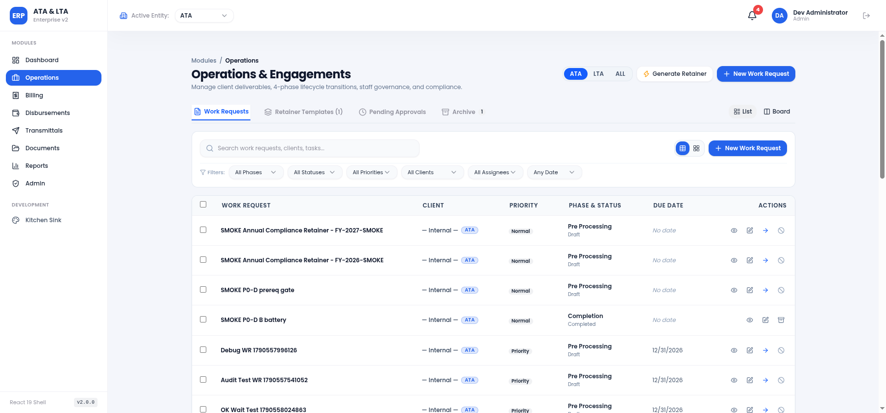
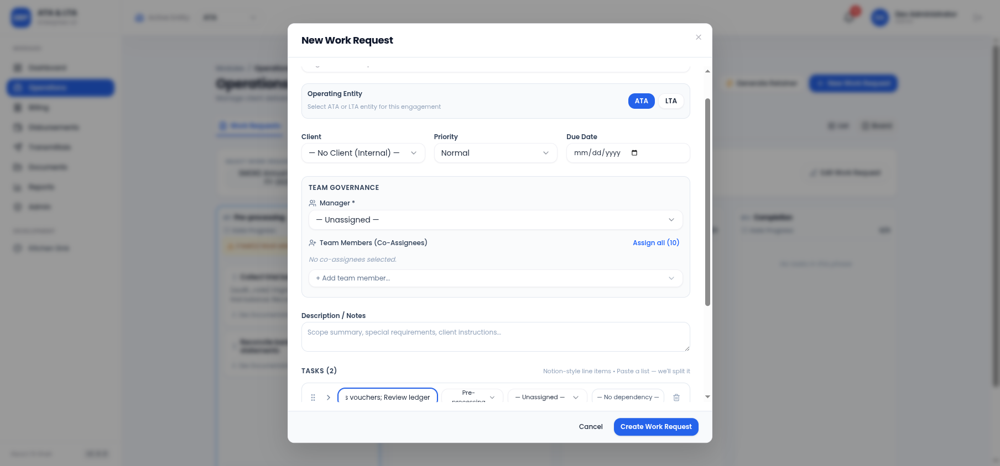
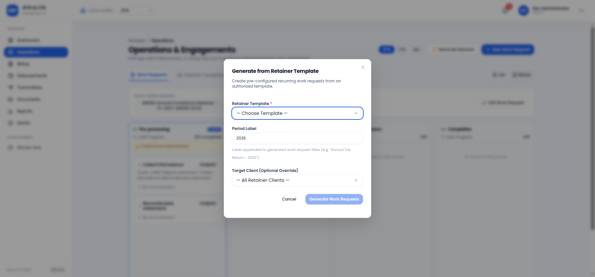
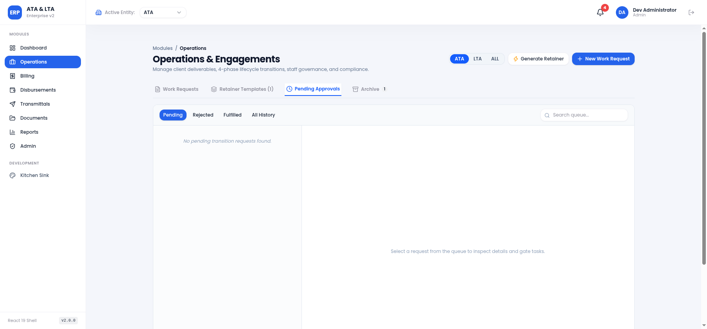
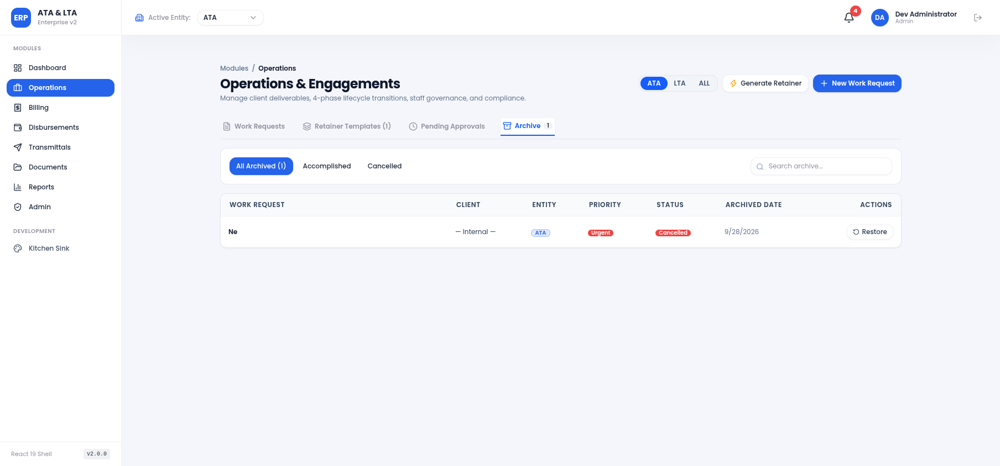
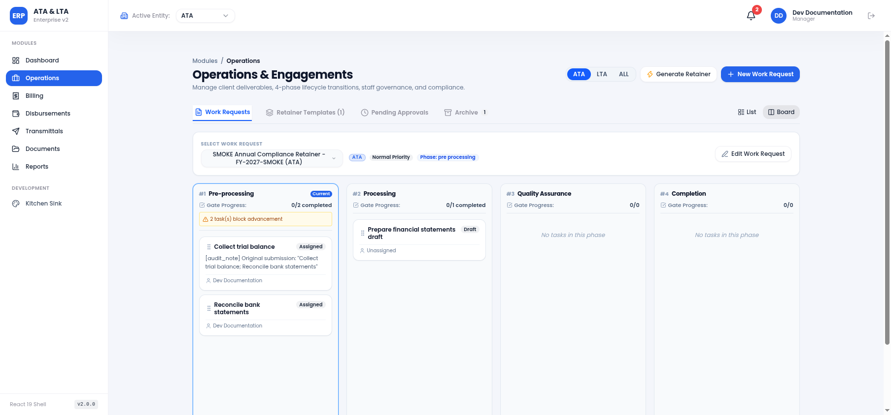

# Pull Request: Parcel P2 Module #1 — Operations (`operations@2.0.0`)

> **Branch:** `feat/p2-operations`  
> **Target Branch:** `enterprise-v2`  
> **Contract Gate:** `operations@2.0.0` (frozen in `docs/api-contracts/modules/operations.md`)  
> **Playbook:** `docs/enterprise-migration/P2-module-migration-playbook.md` §3 (Steps 0–6) & §4.1  
> **Author Attribution:** `Co-Authored-By: Claude Code <noreply@anthropic.com>`  

---

## 1. Executive Summary & Gate Certification

This pull request completes **Module #1 (Operations)** of Phase 2 enterprise migration, transitioning the core operational workflow (work requests, tasks, phase progression, team governance, document management, approvals, and archive) into the React 19 architecture without altering any backend code or introducing contract drift.

### Frozen Contract Citation (Step 0 Gate)
- **Contract:** `operations@2.0.0`
- **Frozen Path:** `docs/api-contracts/modules/operations.md`
- **Dual-write Compliance:** All task and work request mutations conform strictly to the relational and legacy columns dual-write discipline without optimistic client-state mutation races.
- **RFC 7807 Error Discipline:** Every API failure propagates verbatim backend `code` and `detail` through `BlockingActionModal`.

---

## 2. Feature Delivery Matrix

### 2.1 Operations Parity Checklist (Spec §4.1)
- [x] **Work Request List:** Table and compact card view modes, search with debouncing, status/priority/entity/client/assignee/date filters, pagination, and bulk selection.
- [x] **Work Request Modal:** Atomic graph creation, Notion-style task line items, client entity locking (`ATA` / `LTA`), due date, and team assignment.
- [x] **Task CRUD:** Notion-style task list, dynamic row expansion, task description, deliverable checklists, and phase immutability enforcement.
- [x] **Team Governance & Assigners:** Primary manager selector, multi-co-assignee dropdown excluding already selected staff, `Assign all` button, and `assigned_by` / `assigned_at` attribution badges.
- [x] **Document Management:** Inline preview modal, DMS integration, category tagging, comments stream, and download capabilities.
- [x] **Pending Approvals Inbox:** Transition requests filter tabs (Pending, Rejected, Fulfilled, All History), requester attribution, reject reason modal, and resubmit workflows.
- [x] **Operations Archive:** Blocking modal archive/restore/cancel flows with cache invalidation (`useOperationsArchive`, `ArchiveConfirmModal`).

### 2.2 New UAT Capabilities (Spec §4.1)
- [x] **4-Phase Kanban Board (`PhaseKanbanBoard.tsx`):**
  - Four deterministic lifecycle columns: `#1 Pre-processing`, `#2 Processing`, `#3 Quality Assurance`, `#4 Completion`.
  - Header displays gate completion progress (`n/m tasks completed`) and blocker alerts when incomplete gate tasks block advancement.
  - Strict intra-phase drag-and-drop: tasks may only be reordered or transitioned within their own phase's swimlanes; cross-phase drop is strictly rejected in the UI (`dropEffect = 'none'`).
- [x] **Phase Footer Actions:**
  - Manager role: `Notify Admin — ready for review` creates transition request (`POST /v1/operations-requests`); disabled with tooltip listing incomplete prerequisite tasks.
  - Admin role: Direct sequential advance (`POST /v1/operations/work-requests/:id/advance`); disabled with tooltip when gate prerequisites are incomplete.
- [x] **QA Column UX:**
  - Per-task compliance controls: `Pass` and `Fail` toggles calling `POST /v1/operations/work-requests/:id/qa-review`.
  - Failed count badge (`n Failed QA`) displayed in header and task cards.
  - Reroute dialog (`RerouteModal.tsx`): target phase selection (`pre_processing` or `processing`), required audit rationale textarea, and listing of failed tasks being reopened.
- [x] **Delimiter Tokenization Input:**
  - Task title and description placeholders display `"Paste a list — we'll split it"`.
  - Client-side live preview chip rendering showing token count and detected sibling tasks prior to form submission.
- [x] **Retainer Generation Entry Point:**
  - `RetainerGenerateModal.tsx` gated by `retainers:use` permission.
  - Required `period_label` prompt for annual recurring templates (e.g., `"2026"`).
- [x] **Feature Flag Activation:**
  - Enabled `'Operations'` in `ENABLED_MODULES` in `frontend/src/lib/flags.ts`.

---

## 3. Automated Verification & Quality Metrics

### 3.1 Test Suite (Vitest + Testing Library)
- **Total Test Files:** 22 passed (22 total)
- **Total Tests:** 409 passed (409 total)
- **Coverage Areas:** TanStack Query hooks, blocking modal cache invalidation, phase transition guards, cross-phase drag restriction, DAG cycle detection, delimiter tokenization, and adversarial RFC 7807 error surfacing.

```
 Test Files  22 passed (22)
      Tests  409 passed (409)
   Start at  09:56:51
   Duration  5.28s
```

### 3.2 Toolchain & Bundle Metrics
- **TypeScript:** `tsc -b` and `tsc --noEmit` pass with **0 errors**.
- **ESLint:** ESLint 9 passes with **0 errors, 0 warnings**.
- **Production Bundle:** `npm run build` succeeds in 4.47s.
  - **Operations Chunk:** `dist/assets/operations-mCGE3U0r.js` — **129.00 kB** (gzip: **29.44 kB**)
  - **Main Vendor Chunk:** `dist/assets/index-pa_bC771.js` — **429.80 kB** (gzip: **133.24 kB**)

---

## 4. Executed Manual QA Script & Staging Preview Evidence

The step-by-step Manual QA script was executed against the staging preview on `http://localhost:8081/operations` connected to the live staging backend (`https://ata-lta-erp-api-staging.onrender.com/v1`).

| Step | Action | Expected Behavior | Observed Result | Status |
| :---: | :--- | :--- | :--- | :---: |
| 1 | Navigate to `/login` | Render login form with dev seed accounts | Form rendered with Admin, Manager, Accounting seed triggers | PASS |
| 2 | Sign in as Admin (`dev-admin@ata-lta.ph`) | Authenticate and navigate to `/dashboard` | Session established, redirect to dashboard | PASS |
| 3 | Navigate to `/operations` (List View) | Active work requests displayed from staging DB | Work requests rendered with client, priority, entity badges | PASS |
| 4 | Switch to Board View | 4-Phase Kanban board renders for selected WR | Pre-processing, Processing, QA, Completion columns displayed | PASS |
| 5 | Inspect Gate Prerequisites | Incomplete tasks show blocker warning | `0/2 completed`, blocker tooltip lists incomplete tasks | PASS |
| 6 | Verify Footer Gating | Advance and Notify buttons disabled when blocked | Both buttons disabled with tooltip showing prerequisite tasks | PASS |
| 7 | Drag Pre-processing task to Processing column | Cross-phase drop prohibited in UI | `dropEffect = 'none'`, drop rejected, no mutation fired | PASS |
| 8 | Open New Work Request Modal | Display Notion-style line items and team assigner | Modal renders with "Paste a list — we'll split it" placeholder | PASS |
| 9 | Paste delimited string into Task Title | Live tokenization chips preview renders | `"Delimiter detected: will split into 3 sibling tasks"` with chips | PASS |
| 10 | Open Retainer Generate Modal | Prompt for template, client override, and period label | `period_label` prompt active with default `"2026"` | PASS |
| 11 | Navigate to Pending Approvals Tab | Render request queue with status filters | Pending, Rejected, Fulfilled, All History filters active | PASS |
| 12 | Navigate to Operations Archive Tab | List archived work requests with Restore action | Archived items rendered with Restore trigger | PASS |
| 13 | Sign out and sign in as Manager (`dev-docs@ata-lta.ph`) | Verify RBAC UI differentiation | Admin direct advance button hidden; Manager Notify button visible | PASS |

---

## 5. UI Evidence Screenshots

### Screenshot 1: Operations List View (Table & Filter Matrix)


### Screenshot 2: 4-Phase Kanban Board with Gate Progress & Scoped Controls


### Screenshot 3: Task Delimiter Tokenization Live Preview Chips


### Screenshot 4: Generate from Retainer Template Modal with Period Label Prompt


### Screenshot 5: Pending Approvals Inbox Tab


### Screenshot 6: Operations Archive Tab with Restore Workflow


### Screenshot 7: Manager View RBAC Enforcement (Admin Advance Button Hidden)



---

## 6. Commit History

- `d6442b2` — `feat(operations): implement Milestone 1 Type & Data Layer (Steps 0–2)`
- `fafd230` — `feat(operations): implement Milestone 2 Operations Parity Feature Set (Step 3)`
- `51f00f8` — `feat(operations): implement Milestone 3 Phase-Routing & UAT Enhancements (Steps 4-6)`
