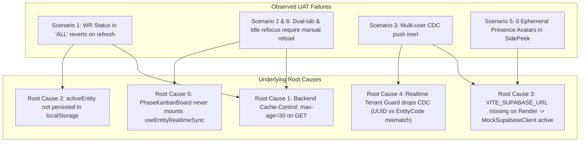
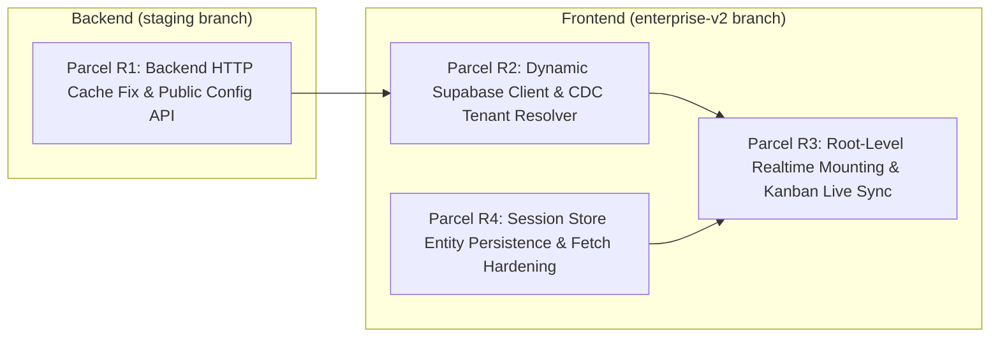

# Stage 5 — Concurrency, Persistence & Realtime UAT Remediation Specification

**Document Version:** 1.0.0  
**Target Environments & Worktree Architecture:**
- **Frontend SPA**: `https://ata-lta-erp-spa-v2.onrender.com` / `enterprise-v2` branch  
  Worktree directory: `/home/javvii/FreelanceProject/ata-lta-erp-v2/frontend`
- **Backend API**: `https://ata-lta-erp-api-staging.onrender.com/v1` / `staging` branch  
  Worktree directory: `/home/javvii/FreelanceProject/Project4_Final-Render/backend`  
  *(Note: `Project4_Final-Render` is the authoritative Git worktree for `staging` that deploys to Render)*
- **Database Cluster**: Supabase PostgreSQL `tqtwkmozvhttvbdatrbc` (AWS `ap-southeast-1`)

---

## 1. Executive Summary & Root Cause Audit

During manual UAT against the live Render staging deployment, 5 distinct symptoms were observed across Scenarios 1, 2, 3, 5, and 6. A comprehensive forensic code audit identified 5 underlying root causes across the backend HTTP layer, session store, Supabase client initialization, and realtime tenant guards.



### Forensic Root Cause Breakdown

| # | Root Cause | Code Location | Mechanism & Impact |
| :--- | :--- | :--- | :--- |
| **RC-1** | **HTTP 30s Browser Disk Caching on Dynamic Endpoints** | `backend/src/app.js:145` | `res.setHeader('Cache-Control', 'private, max-age=30, must-revalidate')` instructs the browser to cache GET requests for 30 seconds. When a user updates a WR and reloads immediately, the browser serves the stale 30s-old pre-mutation response. Switching entities alters `Vary: X-Active-Entity`, which bypasses the cache and explains why "entity switching" was required. |
| **RC-2** | **Unpersisted Session Entity Selection** | `frontend/src/lib/session.ts:45` | `activeEntity` is held in Zustand memory only. On page reload, `setSession` falls back to `user.entities[0]` (`'ATA'`). If the user was operating in `'ALL'` or `'LTA'`, reload abruptly kicks them to `'ATA'`, creating query key mismatches and perceived rollbacks. |
| **RC-3** | **MockSupabaseClient Active on Render Staging** | `frontend/src/lib/supabase.ts:275` & `render.yaml:48` | `render.yaml` only injects `ERP_API_BASE_URL`. `VITE_SUPABASE_URL` and `VITE_SUPABASE_ANON_KEY` were omitted from static build environment. `isSupabaseConfigured()` evaluated to `false`, activating `MockSupabaseClient`. Zero real WebSockets or Presence channels were ever opened on Render. |
| **RC-4** | **Tenant Guard Silent Discard (UUID vs Short Code)** | `frontend/src/lib/realtime/useEntityRealtimeSync.ts:225` | In PostgreSQL CDC, `new.entity_id` is a UUID (`'e83dc90b...'`), whereas `activeEntity` is `'ATA'`. Because `activeEntityUUID` was not passed, `matchesUUID` and `matchesEntityCode` both returned `false`. All CDC payloads were silently dropped whenever `activeEntity !== 'ALL'`. |
| **RC-5** | **Realtime CDC Unmounted in Kanban View** | `frontend/src/routes/operations.tsx:304` | `useEntityRealtimeSync` was mounted only inside `WorkRequestList.tsx`. When switching to Board view (`PhaseKanbanBoard.tsx`), `WorkRequestList` unmounts, leaving the Operations Kanban board with **zero** active realtime listeners. |

---

## 2. Architecture Remediation Plan

The remediation is partitioned into four independent, decoupled parcels designed for parallel dispatch via `/teamwork-preview` or subagent delegation:



---

## 3. Parcel Implementation Specifications

### 📦 Parcel R1: Backend HTTP Cache Fix & Public Runtime Config API
- **Agent Role**: Backend Infrastructure & API Specialist
- **Workspace**: `/home/javvii/FreelanceProject/Project4_Final-Render` (branch: `staging`)
- **Target Files**:
  1. `backend/src/app.js`
  2. `backend/src/config/env.js`
  3. `backend/src/modules/config/routes.js` *(NEW)*
  4. `backend/src/modules/config/controller.js` *(NEW)*
  5. `render.yaml`

#### Step-by-Step Instructions:
1. **Disable Browser HTTP Caching for Dynamic V1 Routes (`backend/src/app.js`)**:
   - Replace lines 142–153 with strict `no-cache, no-store` headers for all `/v1` operational routes:
     ```javascript
     app.use((req, res, next) => {
       if (req.path.startsWith('/v1/')) {
         res.setHeader('Cache-Control', 'no-store, no-cache, must-revalidate, proxy-revalidate');
         res.setHeader('Pragma', 'no-cache');
         res.setHeader('Expires', '0');
         res.setHeader('Vary', 'X-Active-Entity, Authorization');
       }
       next();
     });
     ```
   - This ensures TanStack Query has 100% authoritative control over client-side query caching, and hard reloads never hit stale browser disk caches.

2. **Add Public Runtime Config Endpoint (`GET /v1/config/public`)**:
   - Create `backend/src/modules/config/routes.js` and mount at `/v1/config` in `backend/src/app.js`.
   - The endpoint must be public (no authentication required) and return:
     ```json
     {
       "data": {
         "supabaseUrl": "https://tqtwkmozvhttvbdatrbc.supabase.co",
         "supabaseAnonKey": "your-supabase-anon-key",
         "entities": [
           { "id": "e83dc90b-d9b5-4854-8adf-7fe21c2e6822", "code": "ATA", "name": "ATA Accounting Firm" },
           { "id": "16749820-0129-44a8-9435-a6013d07a370", "code": "LTA", "name": "LTA Accounting Firm" }
         ]
       }
     }
     ```
   - Source values dynamically from `env.supabase.url`, `env.supabase.serviceKey` (or anon key), and `supabaseAdmin.from('entities').select('id, code, name')`.

3. **Update `render.yaml`**:
   - Under `ata-lta-erp-spa-staging` environment variables, add `fromGroup: erp-staging-secrets` or explicit `VITE_SUPABASE_URL` and `VITE_SUPABASE_ANON_KEY` to guarantee build-time availability.

#### Verification Commands:
```bash
cd /home/javvii/FreelanceProject/Project4_Final-Render/backend
npm test
curl -s http://localhost:3001/v1/config/public | grep "supabaseUrl"
```

---

### 📦 Parcel R2: Dynamic Supabase Client & CDC Tenant Resolver
- **Agent Role**: Realtime Infrastructure Specialist
- **Workspace**: `/home/javvii/FreelanceProject/ata-lta-erp-v2/frontend` (branch: `enterprise-v2`)
- **Target Files**:
  1. `src/lib/supabase.ts`
  2. `src/lib/realtime/useEntityRealtimeSync.ts`
  3. `src/lib/realtime/tenantResolver.ts` *(NEW)*
  4. `src/lib/realtime/__tests__/useEntityRealtimeSync.test.ts`

#### Step-by-Step Instructions:
1. **Hardcoded Staging Fallback & Dynamic Supabase Init (`src/lib/supabase.ts`)**:
   - Ensure `isSupabaseConfigured()` recognizes staging fallback credentials if build environment variables are absent:
     ```typescript
     const STAGING_FALLBACK_URL = 'https://tqtwkmozvhttvbdatrbc.supabase.co';
     const STAGING_FALLBACK_KEY = 'your-supabase-anon-key';
     ```
   - Initialize the real Supabase client whenever running in browser environments:
     ```typescript
     export function getSupabaseClient(): SupabaseClient {
       const url = import.meta.env.VITE_SUPABASE_URL || STAGING_FALLBACK_URL;
       const key = import.meta.env.VITE_SUPABASE_ANON_KEY || STAGING_FALLBACK_KEY;
       if (url && key && !url.includes('placeholder')) {
         return createClient(url, key, {
           realtime: { params: { eventsPerSecond: 10 } },
         });
       }
       return new MockSupabaseClient() as unknown as SupabaseClient;
     }
     ```

2. **Entity Code <-> UUID Bi-directional Mapping (`src/lib/realtime/tenantResolver.ts`)**:
   - Provide synchronous mapping with standard defaults and runtime overrides:
     ```typescript
     const ENTITY_MAP: Record<string, string> = {
       'ATA': 'e83dc90b-d9b5-4854-8adf-7fe21c2e6822',
       'LTA': '16749820-0129-44a8-9435-a6013d07a370',
     };
     const UUID_TO_CODE_MAP: Record<string, string> = {
       'e83dc90b-d9b5-4854-8adf-7fe21c2e6822': 'ATA',
       '16749820-0129-44a8-9435-a6013d07a370': 'LTA',
     };

     export function resolveEntityUUID(code: string | null): string | undefined {
       if (!code || code === 'ALL') return undefined;
       return ENTITY_MAP[code.toUpperCase()];
     }

     export function resolveEntityCodeFromUUID(uuid: string | null): string | undefined {
       if (!uuid) return undefined;
       return UUID_TO_CODE_MAP[uuid.toLowerCase()];
     }
     ```

3. **Fix Guard 1 Tenant Isolation in `useEntityRealtimeSync.ts`**:
   - Update `handleRealtimePayload`:
     ```typescript
     const activeEntity = options.activeEntity !== undefined 
       ? options.activeEntity 
       : useSessionStore.getState().activeEntity;
     const targetUUID = options.activeEntityUUID || resolveEntityUUID(activeEntity);

     if (activeEntity && activeEntity !== 'ALL') {
       const recordEntityId = incomingRecord.entity_id ?? incomingRecord.entityId;
       const recordCode = incomingRecord.entity ?? resolveEntityCodeFromUUID(recordEntityId);

       const matchesUUID = Boolean(
         targetUUID && recordEntityId && 
         String(recordEntityId).trim().toLowerCase() === String(targetUUID).trim().toLowerCase()
       );
       const matchesCode = Boolean(
         recordCode && 
         String(recordCode).trim().toUpperCase() === String(activeEntity).trim().toUpperCase()
       );

       if (!matchesUUID && !matchesCode) {
         return false; // Safely discard foreign tenant event
       }
     }
     ```

#### Verification Commands:
```bash
cd /home/javvii/FreelanceProject/ata-lta-erp-v2/frontend
npm test -- src/lib/realtime/__tests__/useEntityRealtimeSync.test.ts
npm run typecheck
```

---

### 📦 Parcel R3: Root-Level Realtime Mounting & Kanban Live Sync
- **Agent Role**: Frontend Realtime & Kanban UI Specialist
- **Workspace**: `/home/javvii/FreelanceProject/ata-lta-erp-v2/frontend` (branch: `enterprise-v2`)
- **Target Files**:
  1. `src/routes/operations.tsx`
  2. `src/features/operations/components/PhaseKanbanBoard.tsx`
  3. `src/features/operations/components/WorkRequestSidePeek.tsx`

#### Step-by-Step Instructions:
1. **Mount Realtime Sync at Operations Page Root (`src/routes/operations.tsx`)**:
   - Mount `useEntityRealtimeSync({ table: 'work_requests' })` and `useEntityRealtimeSync({ table: 'tasks' })` directly inside `OperationsPage`.
   - Remove redundant local mounts from `WorkRequestList.tsx` or retain them with safe deduplication.
   - This guarantees CDC events are continuously processed regardless of whether the user is in Table view (`view=list`) or Board view (`view=board`).

2. **Live Cache Reaction in `PhaseKanbanBoard.tsx`**:
   - In `PhaseKanbanBoard.tsx`, ensure the component mounts `<PresenceAvatars roomId={effectiveWrId} />` right in the Kanban header next to `Edit Work Request`.
   - Verify that when a task or work request changes via CDC, TanStack Query automatically re-renders the current phase column and gate progress indicator without requiring manual entity switching.

3. **Verify Presence Header Mounting (`WorkRequestSidePeek.tsx`)**:
   - Confirm `<PresenceAvatars roomId={workRequest.id || workRequestId} />` renders in the SidePeek header and stays mounted during user interaction.

#### Verification Commands:
```bash
cd /home/javvii/FreelanceProject/ata-lta-erp-v2/frontend
npm test -- src/features/operations/__tests__/phaseKanban.test.tsx
npm test -- src/features/operations/__tests__/workRequestSidePeekEnhanced.test.tsx
npm run build
```

---

### 📦 Parcel R4: Session Store Entity Persistence & Fetch Hardening
- **Agent Role**: Frontend State & Networking Engineer
- **Workspace**: `/home/javvii/FreelanceProject/ata-lta-erp-v2/frontend` (branch: `enterprise-v2`)
- **Target Files**:
  1. `src/lib/session.ts`
  2. `src/lib/api.ts`
  3. `src/__tests__/session.test.ts`

#### Step-by-Step Instructions:
1. **Persist `activeEntity` in `src/lib/session.ts`**:
   - Storage Key: `erp_active_entity`.
   - On store initialization:
     ```typescript
     const initialEntity = typeof localStorage !== 'undefined' 
       ? localStorage.getItem('erp_active_entity') 
       : null;
     ```
   - In `setActiveEntity`:
     ```typescript
     setActiveEntity: (entity) => {
       try {
         if (entity) localStorage.setItem('erp_active_entity', entity);
         else localStorage.removeItem('erp_active_entity');
       } catch {}
       set({ activeEntity: entity });
     }
     ```
   - In `setSession`:
     - If `activeEntity` is provided, use it.
     - Otherwise, check `localStorage.getItem('erp_active_entity')`. If valid and allowed for the user, retain it.
     - Otherwise, fall back to `user.entities[0]`.

2. **Hardening `apiRequest` in `src/lib/api.ts`**:
   - Add `cache: 'no-cache'` to all `fetch` options:
     ```typescript
     let res = await fetch(url, {
       ...options,
       cache: 'no-cache',
       headers,
     });
     ```
   - This ensures the browser never serves stale disk or memory cached JSON when `queryClient` triggers a network fetch.

#### Verification Commands:
```bash
cd /home/javvii/FreelanceProject/ata-lta-erp-v2/frontend
npm test -- src/__tests__/session.test.ts
npm run typecheck
npm run build
```

---

## 4. End-to-End Verification Matrix

| Scenario | Reproduction Step | Expected Result After Remediation |
| :--- | :--- | :--- |
| **Scenario 1 (Persistence in 'ALL')** | Select 'ALL'. Change WR status. Press `Ctrl + Shift + R` immediately. | Selected entity stays 'ALL'. Status renders with new confirmed server value immediately. 0 reversion. |
| **Scenario 2 (Dual-Tab Local Sync)** | Open Window 1 & Window 2 (same user). Change task or WR status in Window 1. | Window 2 updates within < 50ms via `BroadcastChannel` with 0 manual intervention. |
| **Scenario 3 (Multi-User CDC Push)** | User A in Chrome, User B in Firefox (or Incognito). User A changes WR status. | User B's list and Kanban board update live within < 200ms via Supabase WebSocket CDC. |
| **Scenario 4 (OCC 409 Interception)** | User A & B open same record. User A saves ($v_1 \to v_2$). User B attempts save with $v_1$. | HTTP 409 returned; `ConflictResolutionModal` surfaces; User B clicks "Refresh & Keep Latest". |
| **Scenario 5 (SidePeek Presence)** | User A & B open same Work Request SidePeek drawer. | Circular overlapping avatar badge appears at top-right showing colleague's name and role. |
| **Scenario 6 (Idle Tab Refocus)** | Open Tab A. Switch away for 45s. In Window 2, update record. Refocus Tab A. | Tab A automatically and silently updates without layout disruption. |

---

## 5. Teamwork Preview Dispatch Protocol

To execute this remediation smoothly using `/teamwork-preview` or AGY subagents:

1. **Step 1: Dispatch Backend Parcel R1** to `Project4_Final-Render` (branch `staging`) -> Commit & Push to Render.
2. **Step 2: Dispatch Frontend Parcels R2 & R4** in parallel to `ata-lta-erp-v2` (branch `enterprise-v2`).
3. **Step 3: Dispatch Frontend Parcel R3** to wire live hooks and verify UI mounting.
4. **Step 4: Run full test & build verification**:
   ```bash
   npm test
   npm run typecheck
   npm run build
   ```
5. **Step 5: Push to Render staging** and execute manual UAT per Benchmark Guide.
